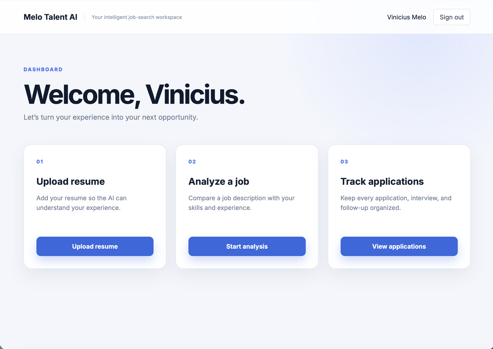
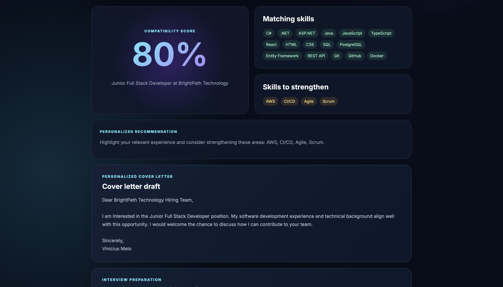
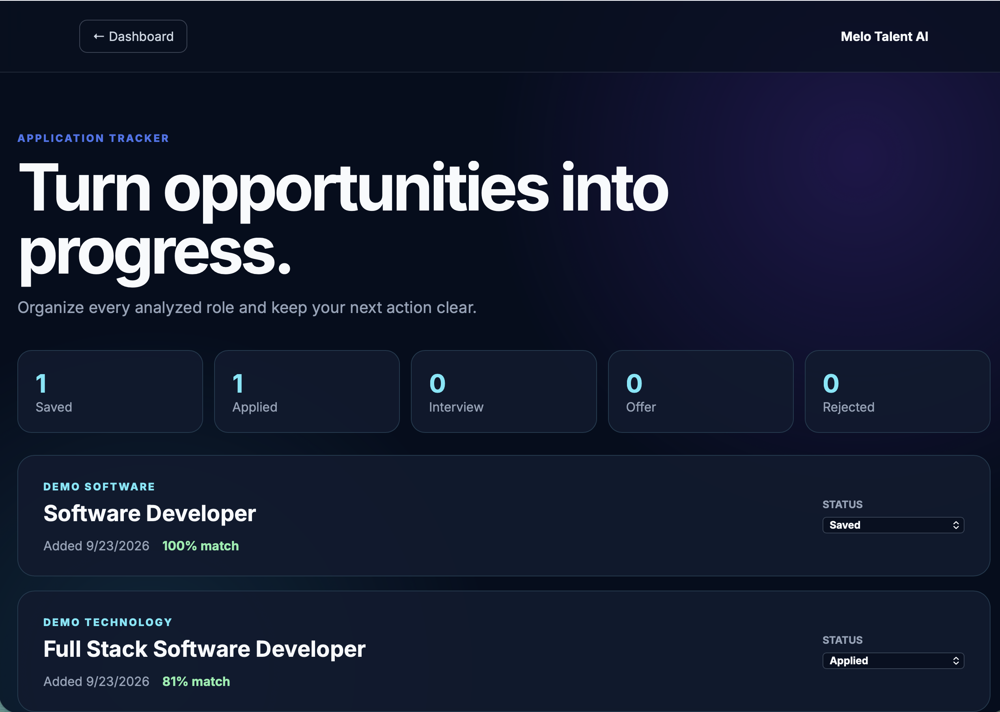

# Melo Talent AI

Melo Talent AI is a full-stack job-search workspace that helps candidates analyze job opportunities, compare requirements with their resume, prepare for interviews, and track applications.

## Features

- Secure account registration and login with JWT authentication
- PDF resume upload and text extraction
- Resume-to-job compatibility analysis
- Match score with matching and missing skills
- Personalized recommendations
- Cover letter draft generation
- Interview preparation questions
- Application tracking with persistent status updates
- Responsive user interface

## Technology Stack

### Backend

- C#
- ASP.NET Core Web API
- Entity Framework Core
- PostgreSQL
- JWT authentication

### Frontend

- React
- TypeScript
- Vite
- Axios
- React Router
- CSS

## Application Workflow

1. Create an account or sign in.
2. Upload a PDF resume.
3. Paste a job description.
4. Review the compatibility score and skill analysis.
5. Use the generated cover letter and interview questions.
6. Track the application through Saved, Applied, Interview, Offer, or Rejected.

## Project Structure

```text
MeloTalentAI
├── src
│   ├── MeloTalentAI.Api
│   │   ├── Controllers
│   │   ├── Domain
│   │   ├── DTOs
│   │   ├── Infrastructure
│   │   ├── Migrations
│   │   └── Services
│   └── MeloTalentAI.Web
│       ├── src
│       │   ├── api
│       │   └── pages
│       └── public
└── MeloTalentAI.slnx
```

## Local Setup

### Requirements

- .NET 10 SDK
- Node.js
- PostgreSQL

### Backend

Configure the connection string and JWT settings using .NET User Secrets:

```bash
dotnet user-secrets set \
  "ConnectionStrings:DefaultConnection" \
  "Host=localhost;Port=5434;Database=melo_talent_ai;Username=YOUR_USER;Password=YOUR_PASSWORD" \
  --project src/MeloTalentAI.Api

dotnet user-secrets set \
  "Jwt:Key" \
  "YOUR_SECURE_DEVELOPMENT_KEY" \
  --project src/MeloTalentAI.Api

dotnet user-secrets set \
  "Jwt:Issuer" \
  "MeloTalentAI.Api" \
  --project src/MeloTalentAI.Api

dotnet user-secrets set \
  "Jwt:Audience" \
  "MeloTalentAI.Web" \
  --project src/MeloTalentAI.Api
```

Apply the database migrations and start the API:

```bash
dotnet ef database update \
  --project src/MeloTalentAI.Api \
  --startup-project src/MeloTalentAI.Api

dotnet run --project src/MeloTalentAI.Api
```

The API runs at `http://localhost:5068`.

### Frontend

```bash
cd src/MeloTalentAI.Web
npm install
npm run dev
```

The frontend runs at `http://localhost:5173`.

## Current Analysis Engine

The current version uses deterministic skill extraction and keyword matching to calculate compatibility scores. A future version can integrate a large language model for more contextual analysis and personalized content.

## Security

- Passwords are stored as hashes.
- Protected endpoints require JWT authentication.
- Database credentials and JWT keys are stored outside source control.
- Uploaded resumes and generated build files are excluded from Git.

## Author

**Vinicius Melo**

Software Developer based in Miami, Florida.

- GitHub: [vini997](https://github.com/vini997)
## Screenshots

### Dashboard



### Job Compatibility Analysis



### Application Tracker


